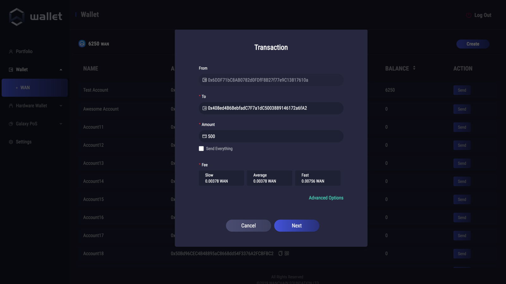
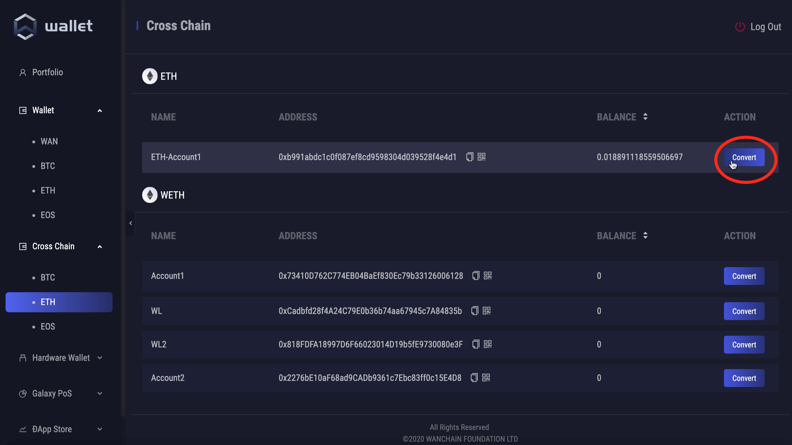
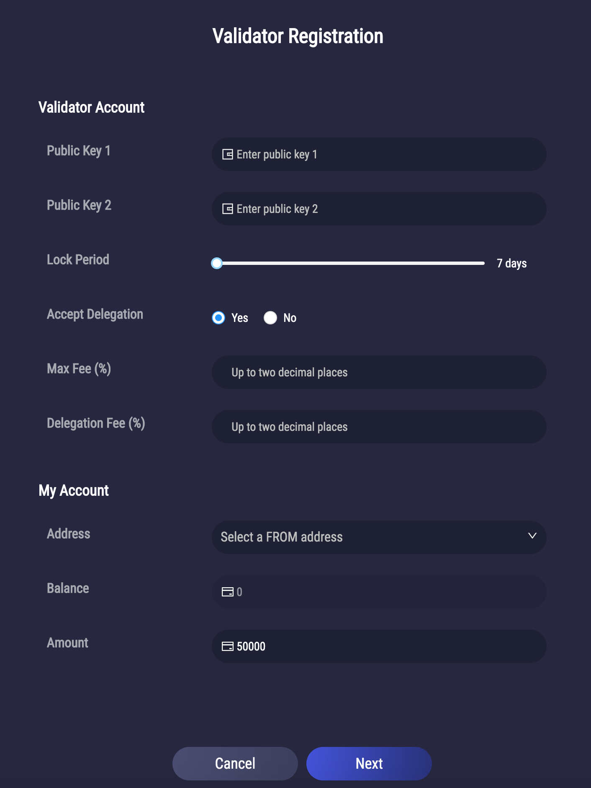
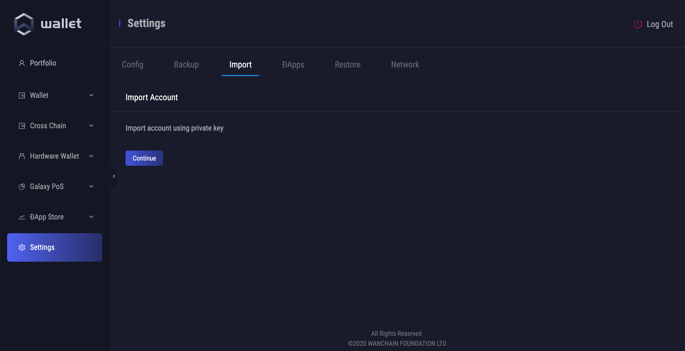
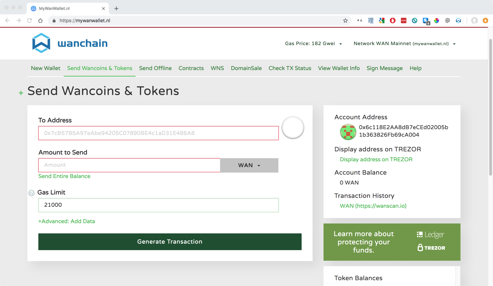
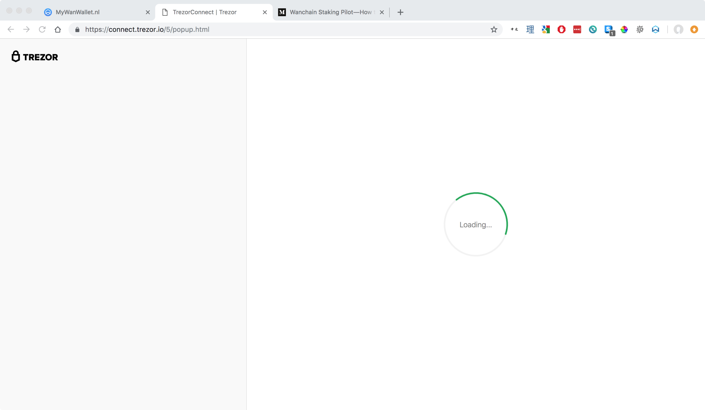
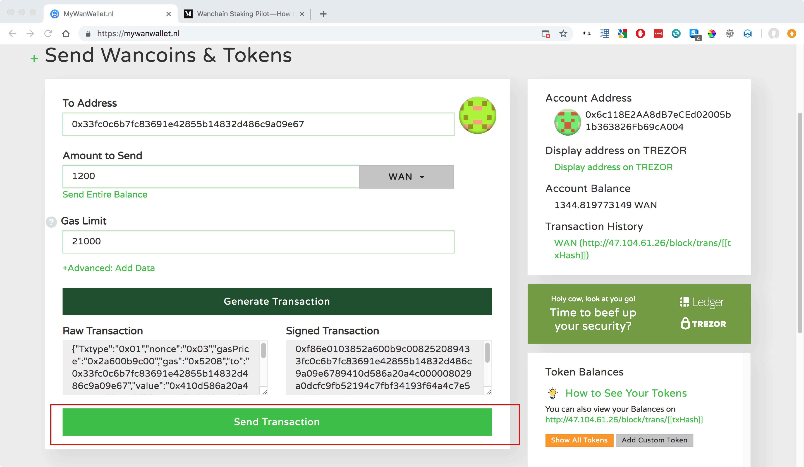
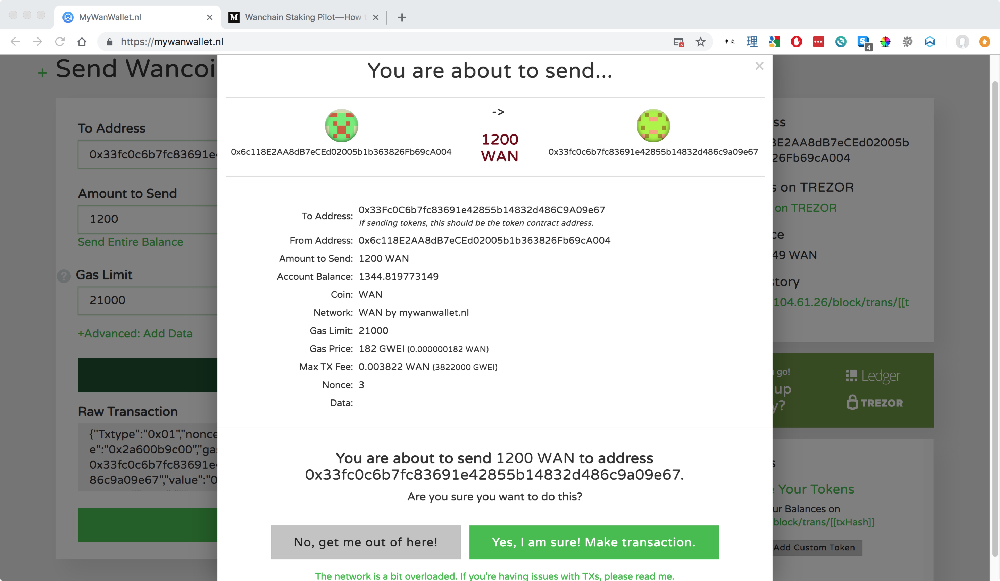

## Wallet Downloads

### Desktop

- [Wan Wallet (Desktop Versions)](https://github.com/wanchain/wan-wallet-desktop/releases)

### Mobile

- [Wan Wallet (Android APK Direct Download](https://raw.githubusercontent.com/wanchain/mobile-wallet-updates/master/mainnet/WanWallet.apk)

- [Wan Wallet (Android Google Play Store Link](https://play.google.com/store/apps/details?id=com.wanchain.WanWallet)

- [Wan Wallet (iOS HK store)](https://itunes.apple.com/hk/app/wanwallet/id1477039507)

- [Wan Wallet (iOS US store)](https://apps.apple.com/us/app/wanwallet/id1477039507)

### Web

- [MyWanWallet (web based)](https://mywanwallet.io/)

## Desktop Wallet Guide

### Wallet Features

Wanchain's first official desktop light wallet is available on Mac, Windows, and Linux and currently supports these features:

* WAN asset management
* Standard transfer and receive transactions
* Making and managing delegations under Galaxy Consensus Proof of Stake
* Ledger hardware wallet support
* Staking support 
* Multi-crypto asset management support
* Private transactions
* Cross chain transactions 

### Setup

#### Download and Install
Download [Wan Wallet](https://medium.com/r/?url=https%3A%2F%2Fgithub.com%2Fwanchain%2Fwan-wallet-desktop%2Freleases).

Double click the install package and follow the on screen instructions to install.

#### Register New Account

When you first open Wan Wallet, you must register a new account. First set your password:

IMPORTANT: Next record your backup mnemonic phrase. Do not take a screenshot, rather you should write it by hand. Do not share your phrase with anyone. This phrase is the only way to recover your account. 

*Note: this is a throw away account, NEVER share your seed phrase with anyone Click 'Next' to complete the new account registration process.*

#### Generate a New Address 

Wan Wallet supports the creation of multiple addresses for one account, simply click: Wallet > WAN > Create

*Wallet > WAN > Create*

Accounts may also be renamed as you wish.

### Get Testnet WAN

You can get testnet WAN from our [faucet](http://54.201.62.90/). Follow the instructions in the link to have testnet WAN sent to your account.

### Normal Transactions
Click 'Send', enter sending and receiving account information along with the transaction amount, select the service fee, and click next, and then click send again to complete your transaction.  

Under 'Advanced Options' are additional parameters which advanced users may adjust.

### Cross Chain Transactions

The Desktop Light Wallet lets you quickly and easily make cross chain transactions. 

To get started, click on the 'Cross Chain' tab on the side menu:   

 

Then choose the asset from the drop down menu you would like to make a cross chain transaction with, and click the 'Convert' button:

*(if the asset you wish to make a transaction with is not displayed, you can add additional Wanchain supported assets from the menu in 'Settings' --> 'Config' --> 'Wallet Options')*

 

After clicking convert, a form will pop up with pre-populated values. 

* 'From (Ethereum)' - Shows account type and name of the 'From' address
* 'Balance' - Shows the current balance of the asset in the 'From' address
* 'Storeman' - Shows the address of the Storeman who your transaction will be sent to
* 'Capacity' - Shows the total capacity of cross chain assets which the Storeman is able to manage. 
* 'Capacity Left' - Shows the remaining capacity of the Storeman. 
*For the above five fields, you do not need to change anything. You only need to make certain that your transaction value does not go over the Storeman's capacity.*
* 'To' - Here you can select the target address where the cross chain asset generated from 'From' address will arrive on the target chain. 
* 'Estimated Fee' - Shows the estimated fees of the cross chain transaction on both chains.
* 'Amount' - This is the amount of the asset you wish to send in your cross chain transaction.

After carefully filling in the 'To' and 'Amount' fields, click 'Next' to review your information and then 'Send' to begin the transaction.

 

You may then check your transaction's current state under 'Transaction History' --> 'Status'. The entire transaction should take several minutes, perhaps longer depending on the current network conditions. Immediately after clicking 'Send', the status should say 'Lock Request Sent'.

 

Shortly after the status will change to 'Locked'.

 

Next the status will change to 'Redemption Request Sent'.
 
 

And finally, the transaction status will change to 'Success', and the newly generated cross chain token will be available for you to transact with in your target 'To' address.

  

The process for returning your asset back to the original chain is the same, except this time click the 'Convert' button on the cross chained asset instead of the native asset, and follow the same instructions as listed above.

### Delegation
Wanchain's newly introduced Galaxy Consensus Proof of Stake has a completely non-custodial delegation mechanism. Users may choose from amongst all available validators the one which they trust to send their delegations too. By delegating their stake to validator nodes in this way, all users have the opportunity to earn consensus rewards. The minimum required amount for delegation is 100 WAN. 

Within the delegation interface users may clearly check their amount of staked WAN, their accumulated rewards from delegation, the yearly return rate for the entire network, and pending withdrawals. Users can also check a table of all their previous delegation transaction history. 

In order to make a new delegation, click 'New Delegation', choose a validator from the list, under 'My Account', choose the account from which you would like to delegate, and enter the amount you would like to delegate in the 'Amount' field. During the process of delegation, there are several parameters you should pay attention to. First, the validator's 'Quota' represents the amount of WAN that validator is able to accept in delegations. Please also note the 'Fee' parameter. This parameter is the percent fee charged as commission by the validator. For example, if the network reward is 50 WAN and the fee is 15%, then you will receive 42.5 WAN as your reward, and 7.5 WAN will be paid to the validator.

In the images below, a user is delegating 100 WAN to a validator node. 

After a completing a delegation, you can see 100 WAN displayed under "My Delegations." Previous delegation details may be viewed from within the delegations history. If the user wishes to increase their delegation, they may click on the 'Top up' button. 

**Note:** Users may exit their delegation at any time, but please note there is ~3 epoch unlocking period after which you can withdraw your WAN.

**Note:** Be sure to turn Contract Data on if you are using a Ledger hardware wallet.

### Validator Node Registration
To access the validator node menu, make sure that you have checked the "Enable Validator" box inside the Settings menu. The "Validator" option will then appear under the "Galaxy PoS" tab on the left.

To register your validator node and start staking, click "Register".

Fill in all the required parameters which were obtained during your [validator setup](staking/node-setup-mainnet) under the "Validator Account" section, and fill in all the information from your funding wallet under "My Account". If you are using Ledger, make certain that you have turned Contract Data on in the settings. When selecting locking period, please note that the longer your locking period, the higher your reward rate. Please use the [staking calculator](http://calculator.wandevs.org/) for reward rate estimates.

### Hardware Wallet
Currently the Ledger hardware wallet is supported. Follow the on screen instructions to connect your Ledger. Other hardware wallets may be supported in the future. Make sure to turn Contract Data on for validation or delegation transactions.

### DApp Store

[Video guide](https://youtu.be/dMpabWAR-iw)

The DApp Store feature of Wan Wallet allows you to experience DApps from creators in the Wanchain ecosystem. In the DApp Store you can find new DApps and add them to your wallet. After adding them to your wallet, you may then directly interact with the DApps through the wallet interface.

### Settings
There are currently three selections under settings, 'Config', 'Backup', 'Import', 'DApps', 'Restore', and 'Network'.

Under 'Config', you may choose to require your password to be input for every transaction.

Under 'Backup', you may enter your password to get your backup mnemonic phrase.

Under 'DApps', you may hide or delete DApps you are not currently using.

Under 'Restore', you may enter your backup phrase to restore a previous wallet.

Under 'Network', you may check network status for troubleshooting purposes.

### Import From Old Desktop Wallet 
**IMPORTANT NOTICE:**  

*Imports from the old desktop wallet will not be backed up with the passphrase generated in the new desktop light wallet. If you import from the old wallet to this wallet, make certain to keep your keystore or private key so that you can import again in case the wallet file is corrupted or you need to reinstall the wallet.* 

**Method 1:**
From the top menu under 'Wan Wallet' --> 'Developer' --> 'Assets' --> 'Wanchain' --> 'Import Keystore File' you may import from the old desktop wallet using your keystore file.   
 

**Method 2:**
On the sidebar menu under 'Settings' --> 'Import' you may import accounts from the old Wan Desktop Wallet to the new, Light Desktop Wallet using your private key. 
 

### Multilingual Support
Under Settings > Language, you may choose your wallet language. We currently have support for English, Chinese, Thai, Korean, Spanish, Portuguese, and French. 

Thank you for downloading and testing the new Wan Wallet! If you have any questions, please feel free to get in touch at techsupport@wanchain.org.  

## Hardware Wallets

### Ledger Support

**Requirements**

| **Software/Hardware** | **Version** |
|:---|:---| 
| [Wanchain GUI wallet](https://wanchain.org/products) | 1.0.5 or later  |
| [Gwan](https://github.com/wanchain/go-wanchain) |   1.0.5 or later| 
|  [Ledger](https://www.ledger.com/) |  Ledger Nano S |  
|  [Ledger Live](https://www.ledger.com/pages/ledger-live) |  1.1.4 or later  | 

Compatible with [MyWanWallet web wallet](https://mywanwallet.nl/) and the official Wanchain Desktop Wallet.

### Trezor Support

**Requirements**  

| **Hardware/Software** | **Version** |
|:---|:---| 
| [Wanchain GUI wallet](https://wanchain.org/products) | 1.0.5 or later  |
| [Gwan](https://github.com/wanchain/go-wanchain) |   1.0.5 or later|  
| Trezor One (Trezor T not supported) |   1.6.2 to 1.7.1|  

*You can find instructions for updating your Trezor firmware [here](https://wiki.trezor.io/index.php?title=User_manual:Updating_your_Trezor%27s_firmware&ModelType=1)*

**Step by Step Guide**

*DISCLAIMER: MyWanWallet.nl is a Wanchain community project. The Wanchain Foundation does not maintain the project or make any guarantees about its security or functionality, and takes no responsibility for any loss or damages incurred through use of MyWanWallet.nl.*

1. Connect your Trezor to your PC by USB and navigate to [https://mywanwallet.nl/](https://mywanwallet.nl/). Double check the address to make sure that it is correct, including 'https' and the 'nl' domain.  

2. Double check that you are on the Wanchain Mainnet and not on the Testnet or any other network. 

3. Select "Trezor" from the radio menu

4. Click "Connect to Trezor" 

  

5. Allow your browser to redirect you by popup to the url beginning with `https://connect.trezor.io`.

6. Wait for the page to load.

  

7. Click the blue button with the text "Allow once for this session" to allow MyWanWallet.nl permission to read the public keys from your Trezor device.

  

8. Click the green button with the text "Export" to export your Trezor device's public keys to MyWanWallet.

  

9. Using the numbers displayed on your Trezor device together with the number pad displayed in your browser, input your Trezor device's passcode in order to export your public key.
  
  
   

10. Select the address with the WAN balance you would like to use, and then click the button with the text "Unlock your Wallet".
  

11. You will now be redirected to your wallet details on MyWanWallet.
  

12. Input the address you want to send to in the "To Address" field.

13. Input how many WAN you want to send in the "Amount to Send" field.

14. You may leave the "Gas Limit" at the default of 21000, and then click click the green "Generate Transaction" button to generate your transaction. 

  

15. Allow your browser to redirect you by popup to the url beginning with `https://connect.trezor.io` and wait for the page to load.
  

16. Click the blue button with the text "Allow once for this session" to allow MyWanWallet.nl permission to sign the transaction with your Trezor device.

  

17. Confirm the transaction on your Trezor device by clicking the right button:

    

18. Confirm again:

    

19. You will be redirected back to the MyWanWallet page where you should click the green button with the text 'Send Transaction' to begin sending your transaction.

  

20. Finally a pop-up window will display all of your transaction details. Please check all the details to make sure they are correct, and click the green button with the text "Yes, I am sure! Make transaction." to complete your transaction.

  
